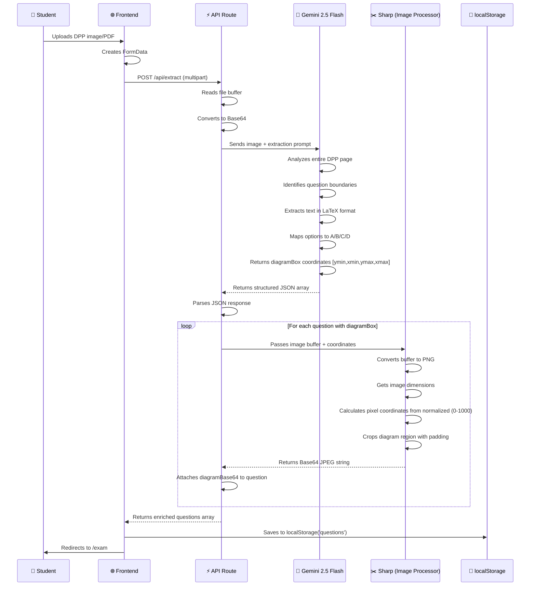
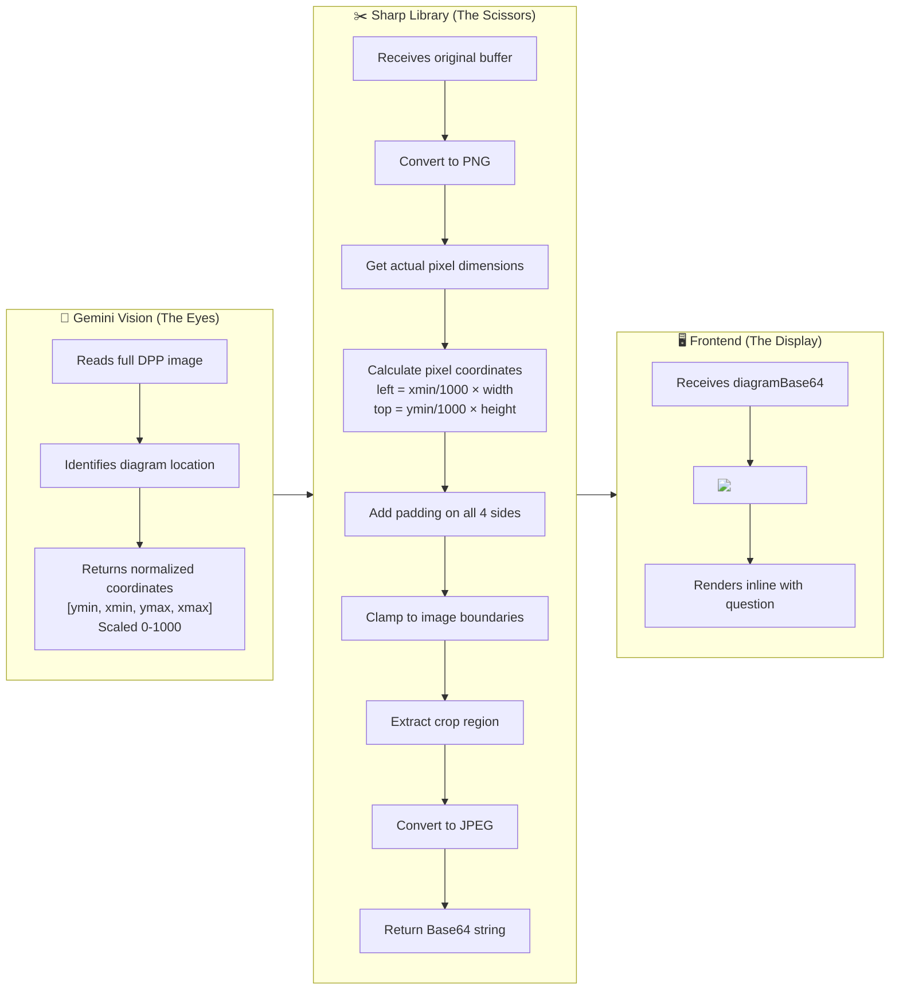
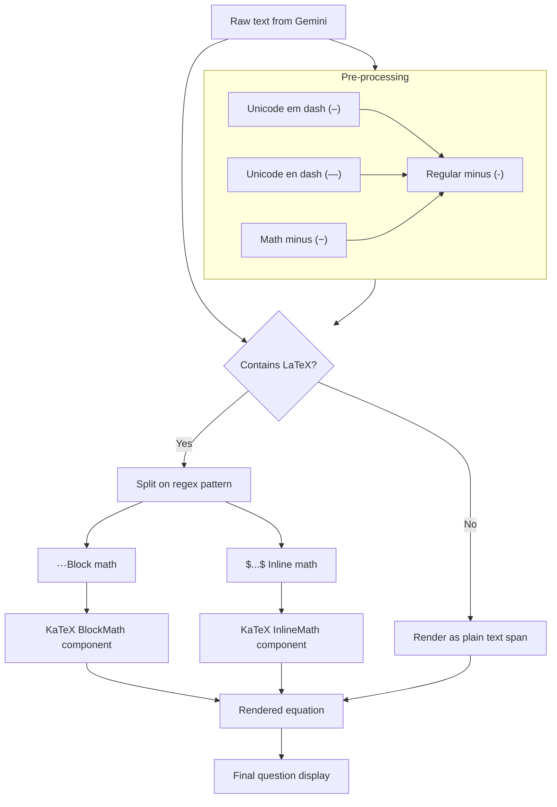
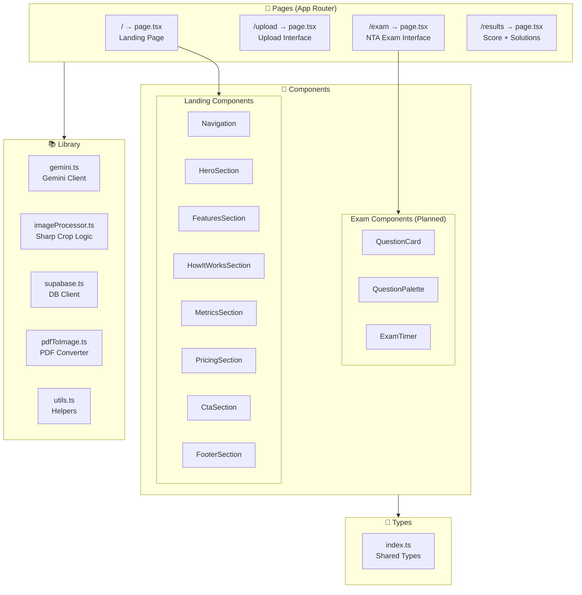
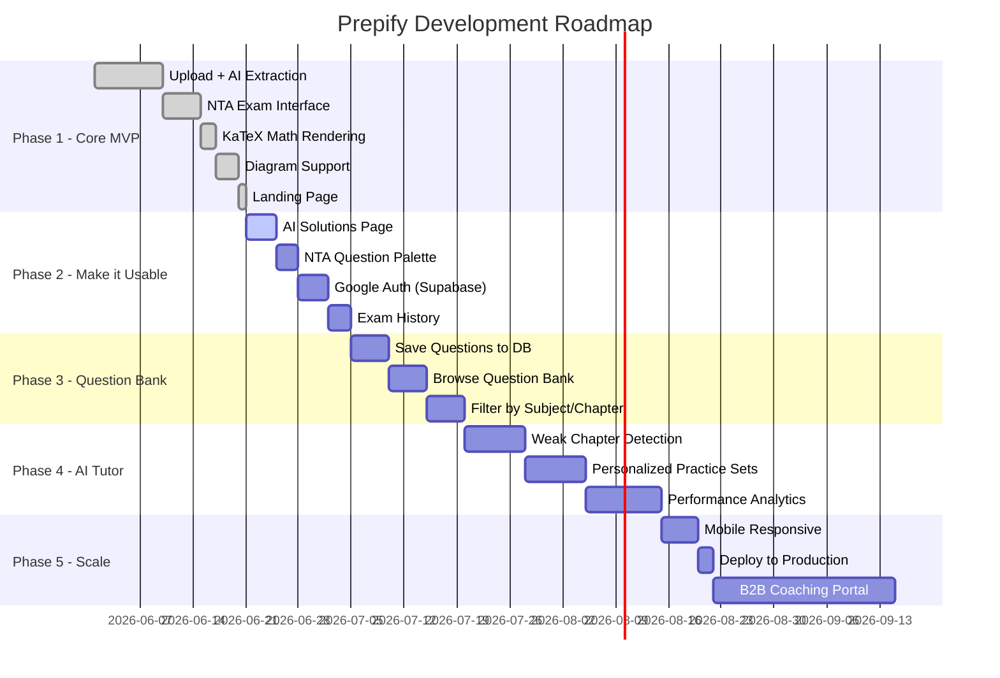
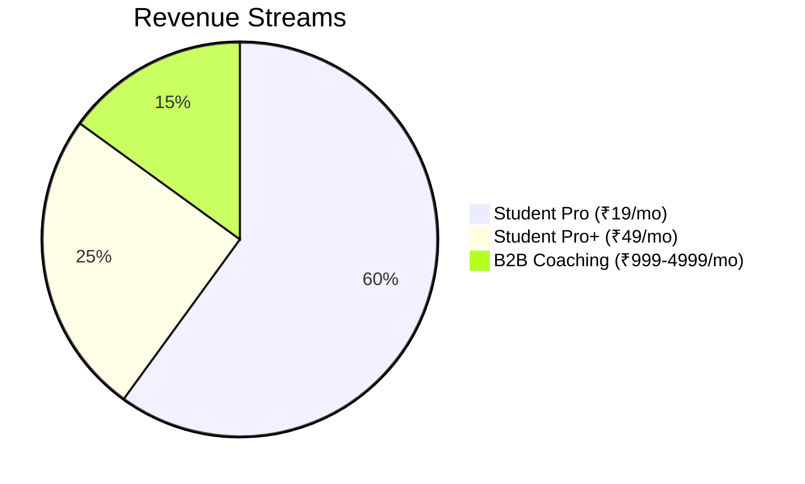

# 🚀 PREPIFY — AI-Powered Exam Practice Platform

<div align="center">


**Turn any DPP into a real NTA exam. Instantly.**

[](https://nextjs.org)
[](https://typescriptlang.org)
[](https://tailwindcss.com)
[](https://ai.google.dev)
[](LICENSE)

[Live Demo](#) · [Report Bug](#) · [Request Feature](#)

</div>

---

## 📖 Table of Contents

- [The Problem](#-the-problem)
- [The Solution](#-the-solution)
- [How It Works](#-how-it-works)
- [Architecture](#-architecture)
- [Tech Stack](#-tech-stack)
- [Project Structure](#-project-structure)
- [API Reference](#-api-reference)
- [Pipeline Deep Dive](#-pipeline-deep-dive)
- [Key Technical Decisions](#-key-technical-decisions)
- [Getting Started](#-getting-started)
- [Environment Variables](#-environment-variables)
- [Roadmap](#-roadmap)
- [Contributing](#-contributing)

---

## 🎯 The Problem

India has **2.5 million+ JEE/NEET aspirants** every year. The difference between a student at Allen Kota and a student in a small town is not intelligence — it is **access**.

| The Gap | Rich Student (Kota) | Poor Student (Small Town) |
|---|---|---|
| Quality DPPs | Paid coaching, printed sheets | Photocopied or nothing |
| Exam Simulation | Full NTA mock tests | No interface, just paper |
| Solutions | Instant from teachers | Wait days or never |
| Performance Analysis | Detailed reports | Self-evaluated or none |

Prepify closes this gap. A poor kid in UP with a 4G phone gets the **exact same practice quality** as someone in Kota — for free.

---

## 💡 The Solution

Prepify is an AI-powered exam practice platform that:

1. **Scans** any coaching DPP or test paper (image or PDF)
2. **Extracts** every question, option, and diagram using Gemini Vision AI
3. **Renders** questions in an exact NTA exam interface with timer
4. **Generates** step-by-step AI solutions after submission
5. **Builds** a crowdsourced question bank from every upload

```
📸 Upload DPP → 🤖 AI Extracts → 📝 NTA Interface → 📊 AI Solutions
```

---

## 🔄 How It Works

### The Full User Journey

```mermaid
flowchart TD
    A([👤 Student]) --> B[Opens Prepify Landing Page]
    B --> C[Clicks Upload DPP]
    C --> D{File Type?}
    D -->|Image| E[JPEG/PNG/WebP Upload]
    D -->|PDF| F[PDF Upload]
    E --> G[/api/extract Route]
    F --> G
    G --> H[Convert to Base64]
    H --> I[Send to Gemini 2.5 Flash Vision]
    I --> J[AI Reads Every Question]
    J --> K{Has Diagrams?}
    K -->|Yes| L[Get DiagramBox Coordinates]
    K -->|No| M[Text + Options Only]
    L --> N[Sharp Library Crops Diagram]
    N --> O[Attach Base64 Diagram to Question]
    M --> P[Return Structured JSON]
    O --> P
    P --> Q[Save to localStorage]
    Q --> R[Redirect to /exam]
    R --> S[NTA Interface Renders]
    S --> T[Student Attempts Exam]
    T --> U[60 Min Timer Countdown]
    U --> V{Submit or Time Up?}
    V --> W[Save Answers to localStorage]
    W --> X[Redirect to /results]
    X --> Y[Show Score + Analysis]
    Y --> Z[AI Solutions for Each Question]
    Z --> A

    style A fill:#4F46E5,color:#fff
    style I fill:#4285F4,color:#fff
    style N fill:#16A34A,color:#fff
    style S fill:#7C3AED,color:#fff
    style Z fill:#DC2626,color:#fff
```

---

### The AI Extraction Pipeline

The core of Prepify is this pipeline. Here's exactly what happens when a student uploads a DPP:



---

### The Diagram Cropping System

This is the most complex technical piece. Here's how we extract diagrams from DPP images:



---

### Math Rendering Pipeline



---

## 🏗️ Architecture

### System Architecture Overview

```mermaid
graph TB
    subgraph CLIENT ["🌐 Client (Browser)"]
        LP[Landing Page /]
        UP[Upload Page /upload]
        EP[Exam Page /exam]
        RP[Results Page /results]
        LS[(localStorage)]
    end

    subgraph SERVER ["⚡ Next.js Server"]
        subgraph API ["API Routes"]
            EX[/api/extract]
            SOL[/api/solutions]
            QS[/api/questions]
        end
    end

    subgraph AI ["🤖 AI Layer"]
        GV[Gemini 2.5 Flash Vision]
        GP[Gemini 2.5 Flash Pro]
    end

    subgraph PROCESSING ["🔧 Processing Layer"]
        SH[Sharp - Image Processor]
        PDF[pdfjs-dist - PDF Converter]
    end

    subgraph DB ["💾 Database (Coming Soon)"]
        SB[(Supabase PostgreSQL)]
        AUTH[Supabase Auth]
    end

    UP -->|POST multipart| EX
    EX -->|Base64 image| GV
    GV -->|JSON questions + coordinates| EX
    EX -->|Buffer + coordinates| SH
    SH -->|Cropped Base64| EX
    EX -->|Enriched questions JSON| UP
    UP -->|Save| LS
    EP -->|Read| LS
    EP -->|Save answers| LS
    RP -->|Read questions + answers| LS
    RP -->|POST questions + answers| SOL
    SOL -->|Prompt| GP
    GP -->|Step-by-step solutions| SOL
    SOL -->|Solutions JSON| RP
```

---

### Component Architecture



---

## 🛠️ Tech Stack

| Layer | Technology | Why We Chose It |
|---|---|---|
| **Framework** | Next.js 16 (App Router) | File-based routing, API routes, SSR |
| **Language** | TypeScript | Type safety, better DX |
| **Styling** | Tailwind CSS + shadcn/ui | Rapid UI, consistent design system |
| **AI Vision** | Gemini 2.5 Flash | Best vision model, handles PDFs natively, free tier |
| **AI Solutions** | Gemini 2.5 Flash | Step-by-step reasoning, math understanding |
| **Image Processing** | Sharp | Fast Node.js image cropping, PNG/JPEG conversion |
| **Math Rendering** | KaTeX + react-katex | LaTeX rendering, fast, no server needed |
| **Database** | Supabase (PostgreSQL) | Free tier, auth built-in, real-time |
| **File Storage** | Cloudflare R2 | 10GB free, cheap at scale |
| **Hosting** | Vercel | Free tier, instant Next.js deploys |
| **PDF Processing** | pdfjs-dist | Convert PDF pages to images without ImageMagick |

---

## 📁 Project Structure

```
prepify/
├── src/
│   ├── app/
│   │   ├── api/
│   │   │   ├── extract/
│   │   │   │   └── route.ts          # 🔑 Core: DPP extraction pipeline
│   │   │   ├── solutions/
│   │   │   │   └── route.ts          # AI step-by-step solutions
│   │   │   └── questions/
│   │   │       └── route.ts          # Question bank CRUD
│   │   ├── exam/
│   │   │   └── page.tsx              # NTA exam interface
│   │   ├── results/
│   │   │   └── page.tsx              # Score + solutions display
│   │   ├── upload/
│   │   │   └── page.tsx              # DPP upload interface
│   │   ├── globals.css               # Global styles + CSS variables
│   │   ├── layout.tsx                # Root layout
│   │   └── page.tsx                  # Landing page
│   ├── components/
│   │   ├── landing/
│   │   │   ├── ascii-scene.tsx       # ASCII art background
│   │   │   ├── cta-section.tsx       # Call to action
│   │   │   ├── features-section.tsx  # Feature cards with particles
│   │   │   ├── footer-section.tsx    # Footer
│   │   │   ├── hero-section.tsx      # Hero with blur word animation
│   │   │   ├── how-it-works-section.tsx
│   │   │   ├── metrics-section.tsx   # Stats counters
│   │   │   ├── navigation.tsx        # Top navbar
│   │   │   └── pricing-section.tsx   # Pricing tiers
│   │   └── ui/                       # shadcn/ui components
│   ├── lib/
│   │   ├── gemini.ts                 # Gemini AI client setup
│   │   ├── imageProcessor.ts         # Sharp crop logic
│   │   ├── pdfToImage.ts             # PDF → image conversion
│   │   ├── supabase.ts               # Supabase client
│   │   └── utils.ts                  # Utility functions
│   └── types/
│       └── index.ts                  # Shared TypeScript types
├── public/
│   └── images/                       # Static assets
├── .env.local                        # Environment variables (never commit!)
├── next.config.ts                    # Next.js configuration
├── tailwind.config.ts                # Tailwind configuration
├── tsconfig.json                     # TypeScript configuration
└── package.json
```

---

## 🔌 API Reference

### POST `/api/extract`

The core endpoint. Accepts a DPP image or PDF and returns structured questions.

**Request:**
```
Content-Type: multipart/form-data
Body: file (File) - image/jpeg, image/png, image/webp, application/pdf
```

**Response:**
```json
{
  "questions": [
    {
      "id": 1,
      "text": "A ring of radius $R$ is rolling over rough horizontal surface with velocity $v_0$.",
      "options": {
        "A": "his angular velocity increases",
        "B": "his moment of inertia decreases",
        "C": "He does positive work",
        "D": "his kinetic energy increases"
      },
      "correct": "A",
      "diagramBox": [292, 270, 440, 500],
      "diagramBase64": "data:image/jpeg;base64,/9j/4AAQ..."
    }
  ]
}
```

**DiagramBox Format:**
```
[ymin, xmin, ymax, xmax]
 ↑      ↑      ↑      ↑
 Top    Left   Bottom Right
 
All values normalized 0-1000 (Gemini's coordinate system)
```

---

### POST `/api/solutions` *(Planned)*

Generates AI solutions for submitted exam answers.

**Request:**
```json
{
  "questions": [...],
  "answers": { "0": "A", "1": "C", "2": "B" }
}
```

**Response:**
```json
{
  "solutions": [
    {
      "id": 1,
      "explanation": "Using Newton's second law...",
      "steps": ["Step 1: ...", "Step 2: ..."],
      "correct": "A",
      "userAnswer": "B",
      "isCorrect": false
    }
  ]
}
```

---

## 🔬 Pipeline Deep Dive

### 1. The Gemini Prompt Engineering

Getting Gemini to reliably extract structured data from noisy, watermarked coaching material was the hardest problem. Here's our final prompt strategy:

```
You are a precise exam paper analyzer. Extract ALL questions from this image.

Return ONLY a valid JSON array. Each question:
{
  "id": 1,
  "text": "question text with LaTeX math in $...$ inline or $$...$$ block",
  "options": { "A": "...", "B": "...", "C": "...", "D": "..." },
  "correct": "A",
  "diagramBox": [ymin, xmin, ymax, xmax]
}

EXTRACTION RULES:
1. Extract EVERY numbered question on the page. Never skip any.
2. Ignore headers, footers, logos, URLs, watermarks.
3. Map options (a)(b)(c)(d) → A B C D always.
4. Always include all 4 options per question.
5. Write all math in LaTeX: $x^2$ inline, $$\int_0^1$$ block.
6. If answer unknown, use "".

DIAGRAM RULES (critical):
7. diagramBox coordinates are normalized 0-1000 as [ymin, xmin, ymax, xmax].
8. ymin = top edge of the drawn figure ONLY, never include question text above.
9. ymax = bottom edge of the drawn figure ONLY, never include options below.
10. xmin/xmax = left/right edges including all floating labels (A, B, C, arrows).
11. The box must contain the complete figure including all labels at extremes.
12. If no diagram exists for a question, omit diagramBox entirely.
```

**Key learnings:**
- Numbered rules work better than bullet points for Gemini
- Explicit "never" and "always" reduce hallucination
- Separating EXTRACTION RULES from DIAGRAM RULES reduces confusion
- The watermark instruction was critical — coaching DPPs have heavy watermarks

---

### 2. The Sharp Coordinate System

Gemini returns coordinates normalized to 1000. Sharp needs actual pixel coordinates. Here's the math:

```
Given: image is 1200px wide × 1600px tall
Given: diagramBox = [292, 270, 440, 500]
       (ymin=292, xmin=270, ymax=440, xmax=500)

Calculate:
  left   = (270/1000) × 1200 = 324px
  top    = (292/1000) × 1600 = 467px
  width  = ((500-270)/1000) × 1200 = 276px
  height = ((440-292)/1000) × 1600 = 237px

With padding (padX=0.12, padY=0.05):
  left   = (270/1000 - 0.12) × 1200 = 180px
  top    = (292/1000 - 0.05) × 1600 = 387px
  width  = ((500-270)/1000 + 0.12×3) × 1200 = 708px
  height = ((440-292)/1000 + 0.08) × 1600 = 365px
```

---

### 3. The KaTeX Rendering System

```typescript
function renderText(text: string) {
  if (!text) return null;

  // Step 1: Sanitize unicode dashes that break KaTeX
  const sanitized = text
    .replace(/\u2013/g, '-')  // em dash
    .replace(/\u2014/g, '-')  // en dash
    .replace(/\u2212/g, '-'); // math minus

  // Step 2: Split on LaTeX delimiters
  // Regex: matches $$...$$  OR  $...$
  const parts = sanitized.split(/(\$\$[\s\S]+?\$\$|\$[^$]+?\$)/g);

  // Step 3: Render each part
  return parts.map((part, i) => {
    if (part.startsWith('$$'))
      return <BlockMath key={i} math={part.slice(2, -2)} />;
    if (part.startsWith('$'))
      return <InlineMath key={i} math={part.slice(1, -1)} />;
    return <span key={i}>{part}</span>;
  });
}
```

This handles mixed content like:
```
"If $f(x) = x^2 + 3x + 2$, find $f'(x)$"
→ ["If ", "$f(x) = x^2 + 3x + 2$", ", find ", "$f'(x)$", ""]
→ [span, InlineMath, span, InlineMath, span]
```

---

### 4. PDF Handling Strategy

PDFs presented a unique challenge: Sharp cannot read PDF buffers directly, and ImageMagick (the common solution) is painful to install on Windows.

Our solution:
```
PDF Upload
    ↓
Gemini reads PDF natively (it supports application/pdf mimetype)
    ↓
Extracts all questions + diagramBox coordinates
    ↓
[Skip diagram cropping for PDFs - Gemini already saw them]
    ↓
Return questions with text descriptions of diagrams
```

For image uploads:
```
Image Upload
    ↓
Send to Gemini as image/jpeg or image/png
    ↓
Get questions + diagramBox coordinates
    ↓
Pass original buffer + coordinates to Sharp
    ↓
Sharp converts buffer to PNG first (fixes Windows format issues)
    ↓
Crop and return Base64
```

---

## 🚀 Getting Started

### Prerequisites

- Node.js 18+ 
- npm or yarn
- Google Gemini API key (free at [aistudio.google.com](https://aistudio.google.com))

### Installation

```bash
# Clone the repository
git clone https://github.com/Curio369/prepify.git
cd prepify

# Install dependencies
npm install

# Install AI and processing packages
npm install @google/generative-ai @supabase/supabase-js sharp uuid
npm install react-katex katex
npm install class-variance-authority clsx tailwind-merge lucide-react
npm install @radix-ui/react-slot tw-animate-css

# Copy environment variables
cp .env.example .env.local

# Start development server
npm run dev
```

Open [http://localhost:3000](http://localhost:3000) 🎉

---

## 🔐 Environment Variables

Create `.env.local` in the root directory:

```env
# Google Gemini AI
GEMINI_API_KEY=your_gemini_api_key_here

# Supabase (optional for now)
NEXT_PUBLIC_SUPABASE_URL=your_supabase_project_url
NEXT_PUBLIC_SUPABASE_ANON_KEY=your_supabase_anon_key
```

**Getting your Gemini API key:**
1. Go to [aistudio.google.com](https://aistudio.google.com)
2. Sign in with Google
3. Click "Get API Key" → "Create API key"
4. Copy and paste into `.env.local`

> ⚠️ **Never commit `.env.local` to git.** It's already in `.gitignore`.

---

## 🗺️ Roadmap



### Feature Checklist

**Phase 1 — Core MVP ✅**
- [x] DPP image upload
- [x] PDF upload support
- [x] Gemini Vision question extraction
- [x] NTA exam interface with timer
- [x] KaTeX math rendering
- [x] Diagram detection and cropping
- [x] Results page with score
- [x] Landing page

**Phase 2 — Usability 🚧**
- [ ] AI step-by-step solutions
- [ ] NTA question palette (numbered sidebar)
- [ ] Mark for review functionality
- [ ] Google OAuth login
- [ ] Exam history per user
- [ ] Mobile responsive design

**Phase 3 — Question Bank 📋**
- [ ] Save questions to Supabase
- [ ] Cross-coaching question bank
- [ ] Filter by subject, chapter, difficulty
- [ ] Practice mode (no timer)

**Phase 4 — AI Tutor 🤖**
- [ ] Weak chapter detection
- [ ] Personalized daily practice sets
- [ ] Difficulty progression system
- [ ] Performance analytics dashboard

**Phase 5 — Scale 🚀**
- [ ] Deploy to Vercel with custom domain
- [ ] B2B portal for coaching institutes
- [ ] All-India leaderboards
- [ ] Payment integration (Razorpay)

---

## 💰 Business Model



| Plan | Price | Features |
|---|---|---|
| **Free** | ₹0/month | 5 DPP uploads, basic solutions |
| **Student Pro** | ₹19/month | Unlimited uploads, full AI solutions, question bank |
| **Student Pro+** | ₹49/month | Everything + AI tutor, personalized sets |
| **Coaching B2B** | ₹999-4999/month | Bulk digitization, white-label, analytics |

### Unit Economics

```
Cost per user per month (average 15 DPPs):
  Gemini Flash (extraction): ₹1.95
  Gemini Pro (solutions):    ₹2.10
  Storage (Cloudflare R2):   ₹0.30
  Total AI cost per user:    ₹4.35

At 5,000 paying users (₹19/month):
  Revenue:    ₹95,000/month
  AI costs:   ₹21,750/month
  Infra:      ₹4,700/month
  Profit:     ₹68,550/month (72% margin)
```

---

## 🧠 The Unfair Advantage — The Flywheel


Unlike PW or Unacademy who **pay crores** to create content, Prepify's question bank **builds itself** with every upload. After 6 months, no competitor can catch up to our question bank size.

---

## 🤝 Contributing

We welcome contributions! Here's how to get started:

```bash
# Fork the repository
# Create your feature branch
git checkout -b feature/amazing-feature

# Commit your changes
git commit -m "feat: add amazing feature"

# Push to the branch
git push origin feature/amazing-feature

# Open a Pull Request
```

### Commit Convention

```
feat: new feature
fix: bug fix
docs: documentation changes
style: formatting, no logic change
refactor: code restructure
perf: performance improvement
test: adding tests
```

---

## 👥 Team

| Name | Role | GitHub |
|---|---|---|
| Curio | Founder, Full Stack + AI | [@Curio369](https://github.com/Curio369) |

*Looking for a co-founder! See the [Founder Brief](docs/FOUNDER_BRIEF.md)*

---

## 📄 License

This project is licensed under the MIT License — see the [LICENSE](LICENSE) file for details.

---

## 🙏 Acknowledgments

- [Google Gemini](https://ai.google.dev) — for the incredible Vision API
- [KaTeX](https://katex.org) — for beautiful math rendering
- [Sharp](https://sharp.pixelplumbing.com) — for blazing fast image processing
- [shadcn/ui](https://ui.shadcn.com) — for the beautiful UI components
- [v0.dev](https://v0.dev) — for the landing page template inspiration
- Every JEE/NEET aspirant who deserves better access to quality education

---

<div align="center">

**Built with ❤️ for every student in India who deserves a fair shot.**

[⭐ Star this repo](https://github.com/Curio369/prepify) · [🐛 Report a bug](https://github.com/Curio369/prepify/issues) · [💡 Request a feature](https://github.com/Curio369/prepify/issues)

</div>
